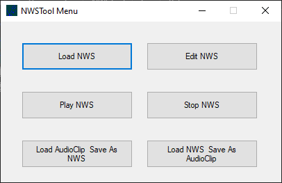
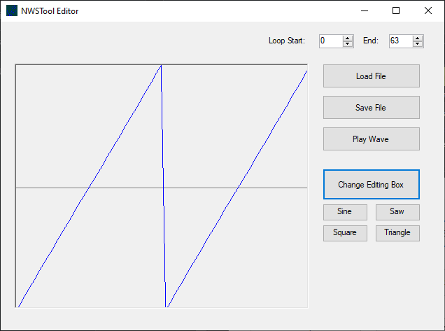
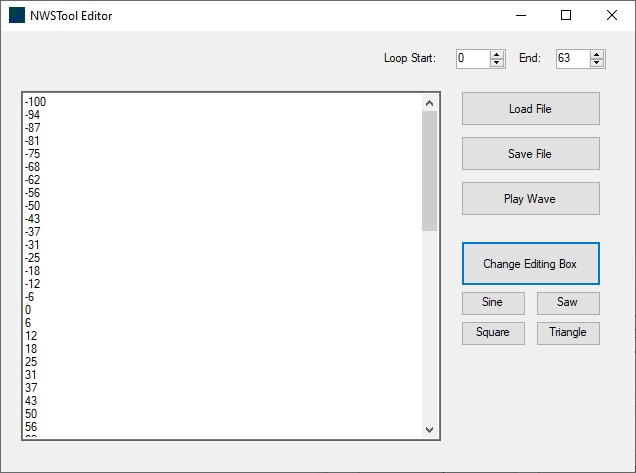

# NWSTool

A C# application for working with the custom `.nws` (Number Wave Sound) file format. NWSTool provides a user-friendly GUI for creating, editing, and converting audio waveforms with a constrained sample range of -100 to 100.

## Features

- **Load & Edit NWS Files** – Open and modify `.nws` files with visual and raw data editing modes
- **Waveform Visualization** – See your audio as a graph and edit it interactively
- **Raw Value Editing** – Switch to list view for precise sample-by-sample control
- **Wave Generation** – Generate common wave shapes: Sine, Sawtooth, Square, Triangle
- **Playback** – Play `.nws` files directly from the tool
- **Audio Conversion** – Import standard audio formats and export to `.nws`, and vice versa
- **Loop Points** – Set custom loop start and end points for seamless playback

## .nws File Format

The `.nws` format is a simple, human-readable text-based audio format with two main sections:

```
properties
{
	loopStart: 0
	loopEnd: 64
}
-100
-87
-75
-62
...
```

- **Properties Block** – Metadata including loop markers
- **Sample Data** – Audio samples constrained to the range -100 to 100

## User Interface

### Main Menu

- Load NWS files
- Edit existing files
- Play/Stop playback
- Convert between audio formats

### Editor

Visual waveform editing with loop point controls and wave shape generators.


Switch to list view for precise editing of individual sample values.

## Getting Started

1. Clone the repository
2. Open in Visual Studio
3. Build the solution
4. Run NWSTool.exe

## Usage

1. **Load a file** – Click "Load NWS" to open an existing `.nws` file or "Load AudioClip" to convert audio
2. **Edit** – Use the waveform view or switch to list view for detailed editing
3. **Generate** – Click Sine, Saw, Square, or Triangle to generate waves
4. **Save** – Save changes back to `.nws` or export as audio format
5. **Play** – Click "Play Wave" to test your creation

## Technology

- **Language:** C#
- **UI Framework:** WinForms
